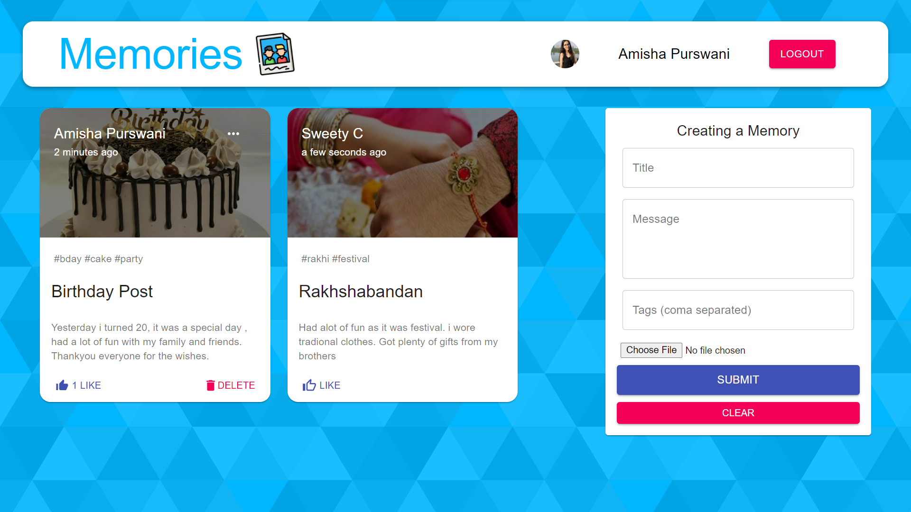

Memories Manager (Full-Stack App)

### Link :link: (will deploy soon)

### Backend Deployed at: :link: https://memories-app6.herokuapp.com/posts

---

---

## Features

- Create and Update Memories
- Like and Delete Memories
- View Other user's memories
-  Authentication (Login/Signup) and with (Google)
- Mobile Responsive
- Pagination

## TO DO

- Recommended Posts
- search by hashtags
- show liked posts

## Tech Stack

- HTML5
- CSS3
- Javascript and ES+6
- Material-UI
- ReactJs
- Redux, Redux-Thunk
- NodeJs
- ExpressJs
- MongoDB Atlas

## Packages

- Frontend
- - axios
- - moment
- - redux
- - redux-thunk
- - @material-ui/core
- - @material-ui/icons
- - material-ui-chip-input
- - @material-ui/lab
- - react-file-base64
- - react-google-login (for google login feature)
- - jwt-decode (web tokens decoding)

- Backend
- - express
- - mongoose (for managing mongoDB)
- - cors
- - dotenv (for environment variables)
- - body-parser
- - nodemon
- - bcryptjs (for password hashing)
- - jsonwebtoken (for web tokens and sessions)
